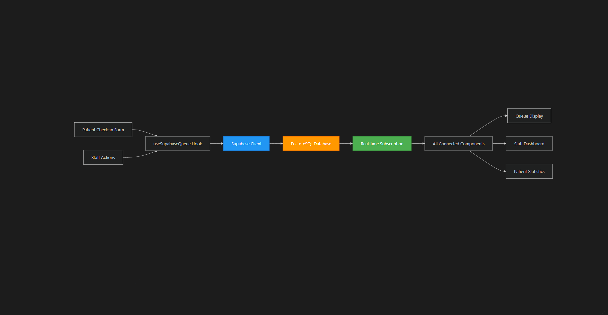

# 🏥 Smart Queue System for Walk-in Clinics
A minimalist digital queue management system designed to replace chaotic walk-in processes at small clinics. No more crowded waiting areas or confused patients — just real-time visibility and smoother experiences for both staff and visitors.

**Black & White UI • Real-Time Updates • Simplicity First**

## 🔄 Workflow at a Glance
- Walk-in patients check in digitally.
- Queue updates in real-time across all devices.
- Patients and staff can view the current queue status.
- Staff can call, delay, or skip patients as needed.

## ⚙️ Tech Stack
### 🖥 Frontend
- React 18.3.1 – UI framework
- TypeScript – Type-safe JavaScript
- Vite – Lightning-fast dev server
- React Router DOM – Routing

### 🎨 UI & Styling
- Tailwind CSS – Utility-first CSS
- Shadcn/ui – Prebuilt components
- Radix UI – Accessibility-focused primitives
- Lucide React – Icon library
- Mono color scheme – Minimalist black/white theme

### 🔧 Forms & State
- React Hook Form + Zod – Forms & validation
- Custom hooks – Local state logic
- TanStack React Query – (Setup for future enhancements)

### 🗄 Backend & Realtime
- Supabase – Backend-as-a-Service
- PostgreSQL – Database
- RLS – Row-level security
- Realtime subscriptions – Live queue updates

### 🧰 Dev Tools
- ESLint – Linting
- TypeScript – Static type checking
- PostCSS + Autoprefixer – CSS post-processing

## 📸 Screenshots
Coming soon — it's all black and white, clean and mean.

## 🚀 Getting Started
```bash
# Clone the repo
git clone https://github.com/your-username/smart-queue-system.git

# Install dependencies
npm install

# Start dev server
npm run dev
```

# Workflow 


# DFD




